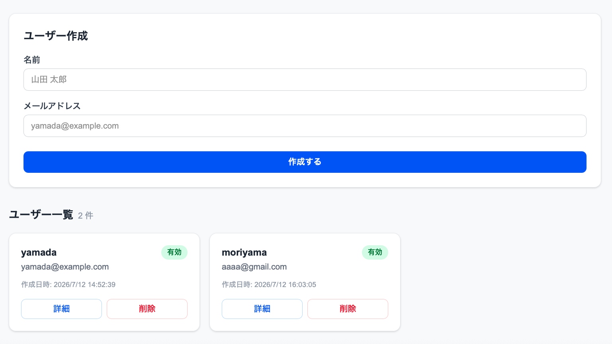
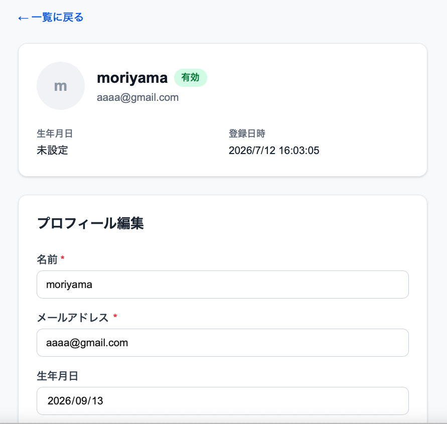
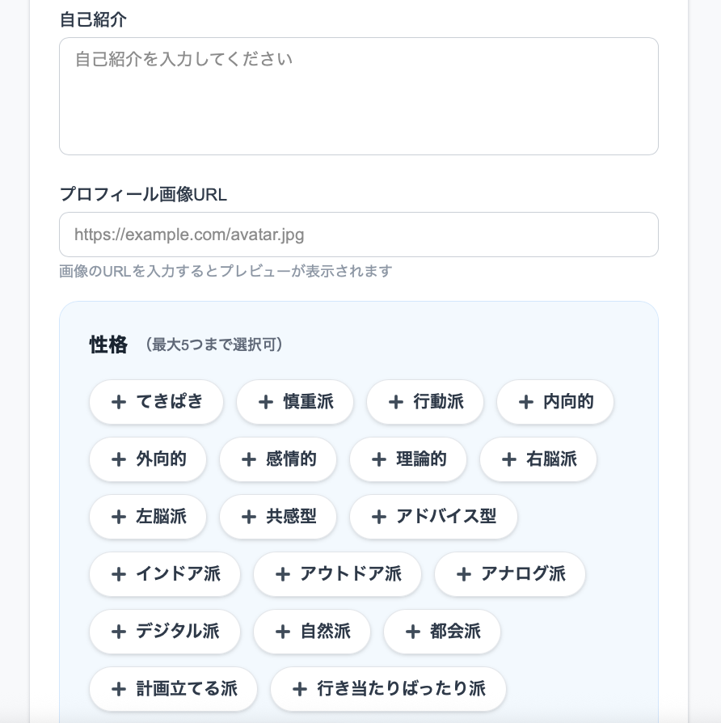
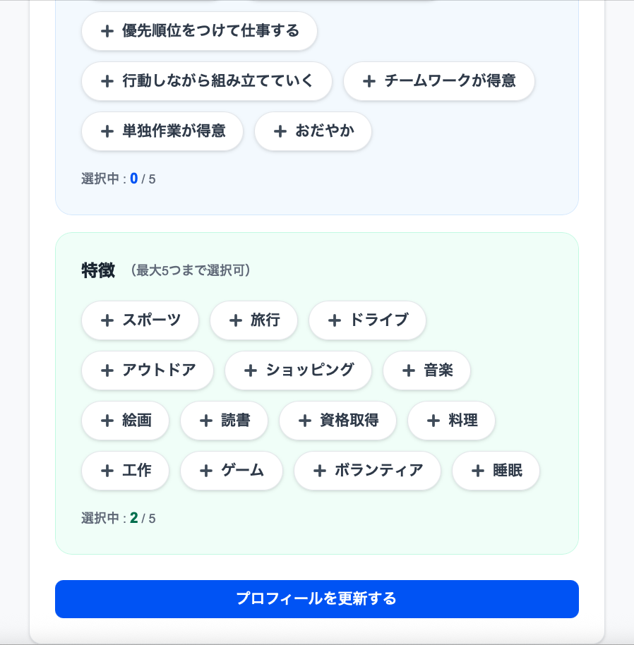

# <a.piece.of.me>
ユーザーが会員登録し、自身の性格・構成するキーワードを選択、
結果をプロフィール帳仕様にまとめ、自己分析ができるアプリ。
管理者はユーザー一覧の閲覧・管理を行える。

## デモ
公開URL:未公開（ローカル確認用）





## 使用技術
| 分類 | 技術 | バージョン |
| --- | --- | --- |
| フロント | Next.js | 15.5.4 |
| フロント | React | 19.2.4 |
| フロント | TypeScript | 5.x |
| フロント | Tailwind CSS | 4.x |
| バック | FastAPI | requirements参照 |
| バック | SQLAlchemy / Alembic | 同上 |
| 認証 | JWT / passlib(bcrypt) | - |
| DB | PostgreSQL | 16 |
| インフラ | Docker / compose | - |

## 環境構築手順

### Docker を使う場合（推奨）
```bash
git clone <このリポジトリのURL>
cd project
docker compose up -d --build
# 初回のみマイグレーションを実行
docker compose exec backend \
alembic upgrade head
```
- フロント: http://localhost:3001
- API: http://localhost:8001
- DB: localhost:5433

### 個別に起動する場合
```bash
# バックエンド
cd backend && python -m venv venv
source venv/bin/activate
pip install -r requirements.txt
cp .env.example .env # 要編集
alembic upgrade head
uvicorn app.main:app --reload --port 8001
# フロントエンド
cd frontend && npm install
cp .env.local.example .env.local
npm run dev
```
## 使い方
1. トップページで「新規登録」
2. プロフィール編集で自己紹介・生年月日・
アイコン画像・タグを設定
3. 一覧から各ユーザーの詳細を閲覧
- テスト用: test@example.com / pass1234

## ディレクトリ構成
```
.
├── backend/app/
│ ├── routers/ # APIエンドポイント
│ ├── models/ schemas/ crud/ # DB層
│ ├── core/ # 設定・認証・DI
│ └── alembic/ # マイグレーション
├── frontend/src/
│ ├── app/ components/ # 画面・UI部品
│ ├── hooks/ context/ # 状態管理
│ └── lib/ # API通信
├── docker-compose.yml
└── README.md
```

## 今後の課題
- [ ] テストコードの追加
- [ ] スマホ表示の最適化
- [ ] 管理者向け機能の拡充
ポイント Docker と個別起動の両方